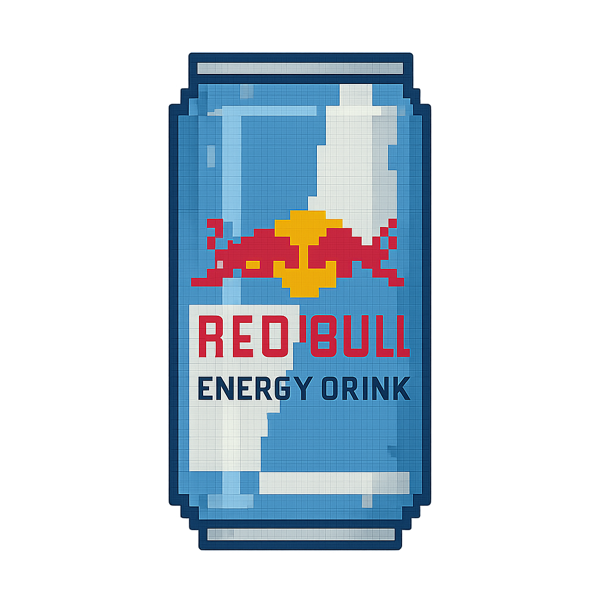
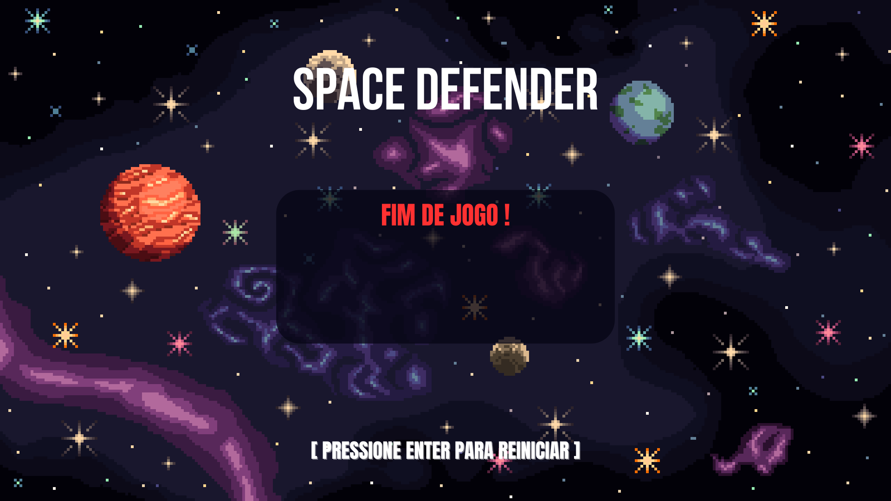

## Space Defender

Space Defender é um jogo desenvolvido com a biblioteca Pygame, inspirado em clássicos como Galaga, Space Invaders e Geometry Wars. O jogador começa com 3 vidas, que podem ser reduzidos ao colidir com inimigos ou ao deixar que eles passem pela nave. No entanto, é possível coletar itens que ajudam a prolongar a sobrevivência da nave. O objetivo do jogo é destruir o maior número possível de aliens.

## Autores

- Rafael Victor (rvpm)
- Marcos Kaiô (mkbs)
- Esdras Santos (evms)
- João Ferreira (jltf)
- Luiz Gouveia (lfcg)
- Guilherme Krauss (gmvck)

## Divisão de Tarefas

| Membros           | Tarefas                                                         |
| ----------------- | ----------------------------------------------------------------|
| rvpm              | Criar coletáveis, código base do jogo                           |
| jltf              | Criação das imagens, efeitos sonoros                            |
| gmvck             | Criação de Imagens                                              |
| lfcg              | Funcionalidade de pausar o jogo                                 |
|evms               | Criação de imagens                                              |
|mkbs               | Menu inicial do jogo, Tela de game over                         |

## Como rodar o jogo
1º - Basta Ter o Python e o Pygame instalados em sua Máquina.

2º - Clonar este repositório ou baixar o arquivo zip.

3º - Abrir a pasta JOGO_IP_EQUIPE2 em um editor de código como VS CODE ou PyCharm

4º - Rodar o arquivo jogo.py.

## Controles

| Atalhos          | Função                                                        |
| ---------------- | ------------------------------------------------------------- |
|  w ,  s          | Movimentação |
|Barra de espaço   | Disparar     |
| P                | Pausar o jogo|

## Itens

| Coletável        | Função                                                        |
| ---------------- | ------------------------------------------------------------- |
| | Regenerar uma vida |
| | Desacelerar o Alien  10s   |
|| Buff de Velocidade 10s |

## Bibliotecas e ferramentas

| Biblioteca          | Utilização                                                       |
| ---------------- | ------------------------------------------------------------- |
| PyGame |	A biblioteca pygame é a principal de nosso projeto, pois ela tem funções específicas que facilitam na criação do jogo, principalmente na questão da renderização de objetos e as interações entre eles.|
| Random |A biblioteca "Random" foi utilizada em algumas partes do código, utilizando a função "Randint", que sorteia um número inteiro dentro de um intervalo definido, fizemos as mecânica para decidir qual coletável seria "dropado" apartir dela.|
| Time | Utilizamos a biblioteca time para controlar o tempo dos coletáveis.|

## Conceitos 

É possível ver ao longo do código, aplicações de diversos conceitos ensinados durante o semestre. Nota-se com uma certa frequência o uso de Comandos condicionais, Laços de repetição, Listas, Tuplas, Funções e principalmente, programação orientada a objeto.

## Organização do Código

O código foi estruturando usando o conceito de programação orientada a objetos. As classes e funções importantes foram:

- Player(): Classe responsável por armazenar os dados e as funções ralacionadas ao player.
- Alien(): Classe responsável por armazenar os dados e as funções relacionadas aos aliens.
- Coletáveis(): Classe responsável por armazenar os dados e as funções relacionadas aos coletáveis.
- Sons(): Classe responsável pelos efeitos sonoros do jogo.
- Disparo(): Classe responsável por armazernar dados do disparo da nave e controlar o sistema de disparo do player.
- respawn(): Função para respawnar o alien após ele ser eliminado.
- desenhar_coletaveis(): Função para decidir qual coletável será dropado.
- desenhar_qnt_coletaveis(): Função para mostrar a quantidade de coletáveis coletados na tela.
- restaurar(): Função para resetar a posição do coletavel após ele ser coletado.
- atirar():: Função para atirar.
- desenhar_vida(): Função para exibir a vida do player.

## Desafios e Experiências

O principal desafio que enfrentamos durante a realização deste projeto foi aprender a utilizar ferramentas e conceitos que nunca havíamos visto antes, como a biblioteca Pygame e a programação orientada a objetos. No entanto, foi extremamente útil adquirir esses conhecimentos, pois eles nos permitiram realizar tarefas muito mais avançadas do que imaginávamos no início do curso.
Outro aprendizado importante que tivemos com este projeto foi o uso de plataformas como o GitHub e o Trello, que nos ajudaram a organizar o desenvolvimento de forma mais eficiente e colaborativa.
  
## Imagens

